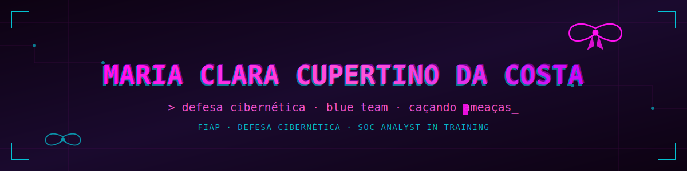

---

## Sobre mim

Sou estudante do curso superior de **Defesa Cibernética** pela **FIAP** (2025–2027) e atuo como **estagiária em Segurança da Informação**, com passagem por Red Team (pentest, hardening, regras de firewall) e atuação atual em Blue Team (SOC, SIEM, SOAR). Por aqui gosto de documentar meus projetos de laboratório, análises de ameaças e o que vou aprendendo no caminho entre atacar e defender.

<table>
<tr>
<td width="50%" align="center" valign="top">

**Foco em Blue Team**

Monitoramento, triagem de alertas e investigação de eventos de segurança via SIEM/SOAR. É onde estou hoje e onde quero crescer.

</td>
<td width="50%" align="center" valign="top">

**Estudando por conta**

MITRE ATT&CK, análise de malware, forense digital e SPL. Sempre com um CTF ou write-up em andamento.

</td>
</tr>
</table>

### No momento, estou explorando...

- **Análise de ameaças** — mapeamento de TTPs e frameworks como MITRE ATT&CK
- **Pentest em laboratório** — exploração de vulnerabilidades conhecidas em ambiente controlado, sempre documentado
- **Detecção com Splunk/SPL** — construção de queries pra identificar padrões suspeitos em cenário de SOC
- **Forense digital** — identificação de artefatos e análise de logs

---

construído em ambiente isolado · aprendendo em público

